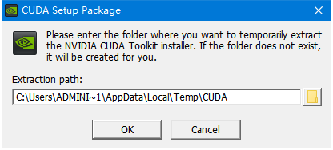
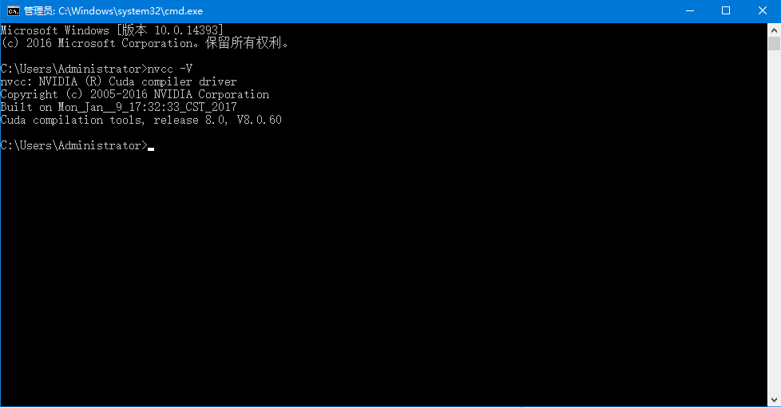

# Windows10下GPU环境安装
------------
## 1 CUDA
### 1.1 CUDA下载
* CUDA是一种由NVIDIA推出的通用并行计算架构，该架构使GPU能够解决复杂的计算问题
* 从 [这里](https://developer.nvidia.com/cuda-toolkit-archive) 下载安装包，选择的版本为8.0+
* 下载Local类型及版本对应补丁<br>


### 1.2 CUDA安装
* 下载结束后，双击 cuda_8.0.61_win10.exe 进行安装<br>

* 选择自定义模式，点击下一步<br> 

* 安装选项默认全部勾选，点击下一步<br>

* 默认安装位置，点击下一步<br> 

* 安装结束<br> 


### 1.3 配置环境变量
  右击我的电脑, 打开 属性 -> 高级系统设置 -> 环境变量, 在系统变量中如下所示配置环境变量
```
CUDA_PATH 		C:\Program Files\NVIDIA GPU Computing Toolkit\CUDA\v8.0
CUDA_PATH_V8_0		C:\Program Files\NVIDIA GPU Computing Toolkit\CUDA\v8.0
CUDA_BIN_PATH 		%CUDA_PATH%\bin
CUDA_LIB_PATH 		%CUDA_PATH%\lib\x64
CUDA_SDK_BIN_PATH	%CUDA_SDK_PATH%\bin\win64
CUDA_SDK_LIB_PATH	%CUDA_SDK_PATH%\common\lib\x64
CUDA_SDK_PATH		C:\Program Files\NVIDIA Corporation\CUDA Samples\v8.0
```
*注意：请确认CUDA的路径与您电脑上的是否一致*

### 1.4 检查安装情况
* 打开命令行cmd，输入nvcc -V, 检查安装情况<br>



## 2 cuDNN
* 从 [这里](https://developer.nvidia.com/cudnn) 下载对应版本的cuDNN，选择的版本为6.0+
* 下载时需要注册登录
* 下载完成后，将下载得到的压缩包解压缩
* 将cudnn64_6.dll, cudnn.h, cudnn.lib 分别复制到CUDA安装路径下的bin, include, lib\x64文件夹中<br> 
*CUDA默认安装路径为 C:\Program Files\NVIDIA GPU Computing Toolkit\CUDA\v8.0*
